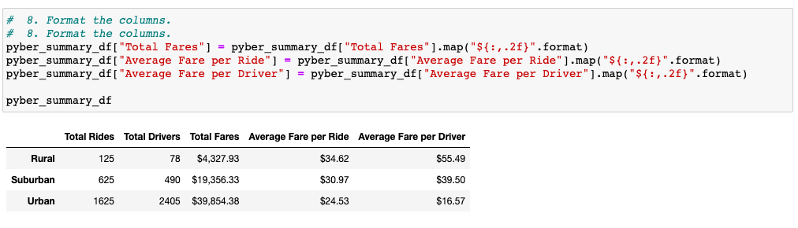
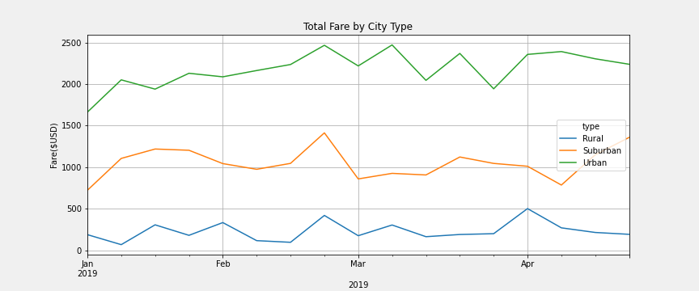
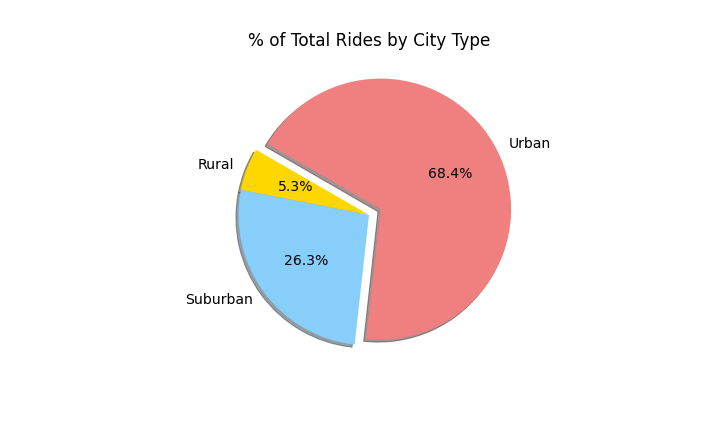

# PyBer_Analysis

## Table of Contents

- [Overview of the analysis](#overview-of-the-analysis)
- [Results](#results)
- [Summary](#summary)

### Overview of the analysis

The reason for this composed report for Data Analyst at PyBer is to make a total rundown of the Ride-Sharing information by city type. Counting a fast rundown of line, bar, disperse, air pocket, pie, and box-and-hair plots utilizing Matplotlib libraries. What's more, decide to mean, middle, and mode utilizing Pandas, NumPy, and SciPy insights. Our Final Analysis incorporates numerous line charts of the absolute week after week passages for every city type.

### Results

> Utilizing pictures from the synopsis DataFrame and various line outline, depict the distinctions in ride-dividing information between the diverse city types:

  - The Suburban passages began around $1,000, and the examination was not beneficial, toll dropped in March and in mid-April. 

  - The Rural passages began at around $200, the examination shows tolls increment and dropped till the finish of April. 

  - The Urban passages start with a normal of $1,800 with a reliable increment of around 2,300.

### Summary

We ran the investigation and pictured a portion of the rundowns for ride sharing. 

There are a larger number of rides in Urban areas than Suburban or Rural.

Percent of absolute drivers by city type follow a similar example with more drivers being in urban communities.

The normal passage per ride with the normal fare per driver is generally costly in the rural city type and more affordable in the metropolitan city type. Indeed, rustic city-type rides are higher; in any case, more admission dollars are produced using metropolitan city-type fares.

